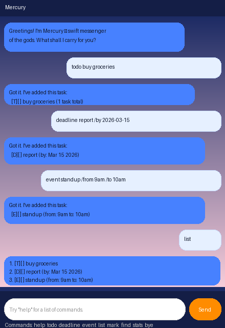

# Mercury User Guide

> *Swift as the wind, Mercury delivers your tasks.*

Mercury is a personal task manager chatbot with a JavaFX GUI and a CLI mode. It helps you track todos, deadlines, and events — and keeps you motivated along the way.



---

## Quick Start

1. Ensure **Java 21** is installed on your computer.
2. Download the latest `mercury.jar` from the [Releases](https://github.com/manyag-25/ip/releases) page.
3. Open a terminal, navigate to the folder containing the JAR, and run:
   ```
   java -jar mercury.jar
   ```
4. The Mercury window will open. Type a command in the input field and press **Enter** or click **Send**.

---

## Features

### Add a Todo
Add a simple task with no date.

**Format:** `todo DESCRIPTION`

**Example:** `todo buy groceries`

**Output:**
```
Got it. I've added this task:
  [T][ ] buy groceries
Now you have 1 tasks in the list.
```

---

### Add a Deadline
Add a task with a due date.

**Format:** `deadline DESCRIPTION /by YYYY-MM-DD`

**Example:** `deadline submit report /by 2026-03-15`

**Output:**
```
Got it. I've added this task:
  [D][ ] submit report (by: Mar 15 2026)
Now you have 2 tasks in the list.
```

---

### Add an Event
Add a task with a start and end time.

**Format:** `event DESCRIPTION /from TIME /to TIME`

**Example:** `event team standup /from 9am /to 10am`

**Output:**
```
Got it. I've added this task:
  [E][ ] team standup (from: 9am to: 10am)
Now you have 3 tasks in the list.
```

---

### List All Tasks
Show all tasks currently tracked.

**Format:** `list`

**Output:**
```
Here are the tasks in your list:
1. [T][ ] buy groceries
2. [D][ ] submit report (by: Mar 15 2026)
3. [E][ ] team standup (from: 9am to: 10am)
```

---

### Mark a Task as Done
Mark a task as completed.

**Format:** `mark INDEX`

**Example:** `mark 1`

**Output:**
```
I've marked this task as done:
  [T][X] buy groceries
```

---

### Unmark a Task
Revert a completed task back to not done.

**Format:** `unmark INDEX`

**Example:** `unmark 1`

---

### Delete a Task
Remove a task from the list.

**Format:** `delete INDEX`

**Example:** `delete 2`

**Output:**
```
Noted. I've removed this task:
  [D][ ] submit report (by: Mar 15 2026)
Now you have 2 tasks in the list.
```

---

### Find Tasks
Search for tasks matching a keyword.

**Format:** `find KEYWORD`

**Example:** `find report`

**Output:**
```
Here are the matching tasks in your list:
1. [D][ ] submit report (by: Mar 15 2026)
```

---

### View Statistics
See a summary of your task progress.

**Format:** `stats`

**Output:**
```
Task Statistics:
  Total tasks  : 3
  Done         : 1
  Pending      : 2
  Todos        : 1
  Deadlines    : 1
  Events       : 1
```

---

### Get Motivation
Receive a random motivational quote.

**Format:** `cheer`

---

### Help
Display all available commands.

**Format:** `help`

---

### Exit
Close Mercury.

**Format:** `bye`

---

## Task Format Reference

| Symbol | Meaning |
|--------|---------|
| `[T]`  | Todo    |
| `[D]`  | Deadline |
| `[E]`  | Event   |
| `[X]`  | Done    |
| `[ ]`  | Not done |

---

## Data Storage

Tasks are automatically saved to `./data/duke.txt` whenever you add, delete, mark, or unmark a task. The file is re-loaded when Mercury starts, so your tasks persist between sessions.

If the data file is missing (e.g., first launch), Mercury starts with an empty list.

---

## Error Handling

Mercury provides clear error messages for invalid input:

- Wrong command name → tells you which word it did not understand
- Missing task number for `mark`/`unmark`/`delete` → prompts you to provide one
- Invalid date format for `deadline` → reminds you to use `yyyy-mm-dd`
- Non-existent dates (e.g., `2026-02-30`) → flagged as invalid
- Duplicate tasks → rejected with a descriptive message

---

## FAQ

**Q: Can I use the app from the command line?**
Yes. Run `java -jar mercury.jar` and interact via the terminal using the same commands.

**Q: Where is my data saved?**
In `./data/duke.txt`, relative to the folder you ran the JAR from.

**Q: What happens if the data file is corrupted?**
Mercury skips unreadable lines and starts fresh. You may lose tasks from a corrupted file.

**Q: Can I have two tasks with the same description?**
No. Mercury prevents exact duplicates to avoid confusion.
